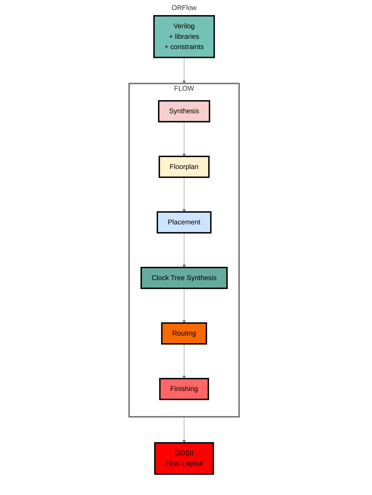
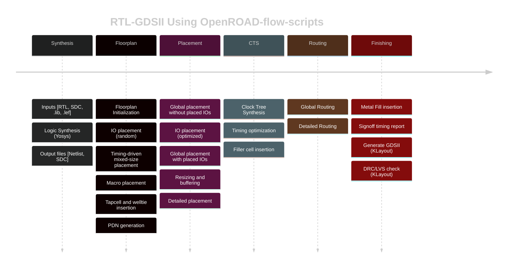

# OpenROAD

## About OpenROAD

OpenROAD is the leading open-source, foundational application for
semiconductor digital design. The OpenROAD flow delivers an
Autonomous, No-Human-In-Loop (NHIL) flow, 24 hour turnaround from
RTL-GDSII for rapid design exploration and physical design implementation.

## OpenROAD Mission

[OpenROAD](https://theopenroadproject.org/) eliminates the barriers
of cost, schedule risk and uncertainty in hardware design to promote
open access to rapid, low-cost IC design software and expertise and
system innovation. The OpenROAD application enables flexible flow
control through an API with bindings in Tcl and Python.

OpenROAD is used in research and commercial applications such as,
- [OpenROAD-flow-scripts](https://github.com/The-OpenROAD-Project/OpenROAD-flow-scripts)
  from [OpenROAD](https://theopenroadproject.org/).
- [OpenLane](https://github.com/The-OpenROAD-Project/OpenLane) from
  [Efabless](https://efabless.com/).
- [Silicon Compiler](https://github.com/siliconcompiler/siliconcompiler)
  from [Zero ASIC](https://www.zeroasic.com/).
- [Hammer](https://docs.hammer-eda.org/en/latest/Examples/openroad-nangate45.html)
  from [UC Berkeley](https://github.com/ucb-bar).
- [OpenFASoC](https://github.com/idea-fasoc/OpenFASOC) from
  [IDEA-FASoC](https://github.com/idea-fasoc) for mixed-signal design flows.
- [mflowgen](https://github.com/mflowgen/mflowgen) modular flow specification and build-system generator for ASIC and FPGA.
  Find OpenROAD integration [here](https://mflowgen.readthedocs.io/en/latest/stdlib-openroad.html#integration-with-openroad).

OpenROAD fosters a vibrant ecosystem of users and developers through active
collaboration, partnerships on key open-source software, education, and workforce development programs.
Our growing user community ([link](https://theopenroadproject.org/community/))
includes hardware designers, software engineers, industry collaborators, VLSI enthusiasts,
educators, students, and researchers.
They have access and can contribute to a dynamic [body of resources](https://theopenroadproject.org/resources/).

OpenROAD strongly advocates and enables IC design-based education
and workforce development initiatives through training content and
courses across several global universities, the Google-SkyWater
[shuttles](https://platform.efabless.com/projects/public) also
includes GlobalFoundries shuttles, design contests, and IC design
workshops.

## Getting Started with the Native OpenROAD Flow

OpenROAD provides [OpenROAD-flow-scripts](https://github.com/The-OpenROAD-Project/OpenROAD-flow-scripts)
as a native, ready-to-use prototyping and tapeout flow. However,
it also enables the creation of any custom flow controllers based
on the underlying tools, database and analysis engines. Please refer
to the flow documentation [here](https://openroad-flow-scripts.readthedocs.io/en/latest/).

OpenROAD-flow-scripts (ORFS) is a fully autonomous, RTL-GDSII flow
for rapid architecture and design space exploration, early prediction
of QoR and detailed physical design implementation. However, ORFS
also enables manual intervention for finer user control of individual
flow stages through Tcl commands and Python APIs.

The figure below shows the main stages of the OpenROAD-flow-scripts:

Here are the main steps for a physical design implementation
using OpenROAD;

- `Floorplanning`
  - Floorplan initialization - define the chip area, utilization
  - IO pin placement (for designs without pads)
  - Tap cell and well tie insertion
  - PDN- power distribution network creation
- `Global Placement`
  - Macro placement (RAMs, embedded macros)
  - Standard cell placement
  - Automatic placement optimization and repair for max slew,
    max capacitance, and max fanout violations and long wires
- `Detailed Placement`
  - Legalize placement - align to grid, adhere to design rules
  - Incremental timing analysis for early estimates
- `Clock Tree Synthesis`
  - Insert buffers and resize for high fanout nets
- `Optimize setup/hold timing`
- `Global Routing`
  - Antenna repair
  - Create routing guides
- `Detailed Routing`
  - Legalize routes, DRC-correct routing to meet timing, power
    constraints
- `Chip Finishing`
  - Parasitic extraction using OpenRCX
  - Final timing verification
  - Final physical verification
  - Dummy metal fill for manufacturability
  - Use KLayout or Magic using generated GDS for DRC signoff

### GUI

The OpenROAD GUI is a powerful visualization, analysis, and debugging
tool with a customizable Tcl interface. To see some examples of our GUI
click [here](https://github.com/The-OpenROAD-Project/OpenROAD?tab=readme-ov-file#gui).

### PDK Support

The OpenROAD application is PDK independent. However, it has been tested
and validated with specific PDKs in the context of various flow
controllers.

OpenROAD-flow-scripts supports several public and private PDKs
including:

#### Open-Source PDKs

-   `GF180` - 180nm
-   `SKY130` - 130nm
-   `Nangate45` - 45nm
-   `ASAP7` - Predictive FinFET 7nm
-   `IHP` - 130nm BiCMOS

#### Proprietary PDKs

These PDKS are supported in OpenROAD-flow-scripts only. They are used to
test and calibrate OpenROAD against commercial platforms and ensure good
QoR. The PDKs and platform-specific files for these kits cannot be
provided due to NDA restrictions. However, if you are able to access
these platforms independently, you can create the necessary
platform-specific files yourself.

-   `GF55` - 55nm
-   `GF12` - 12nm
-   `Intel22` - 22nm
-   `Intel16` - 16nm
-   `TSMC65` - 65nm

## Tapeouts

OpenROAD is silicon-proven for over 1,000 in SKY130 and GF180 through
the Google-sponsored, Efabless [MPW shuttle](https://efabless.com/open_shuttle_program),
[ChipIgnite](https://efabless.com/) and [Tiny Tapeout](https://tinytapeout.com/) programs.

## License

BSD 3-Clause License. See [LICENSE](LICENSE) file.
